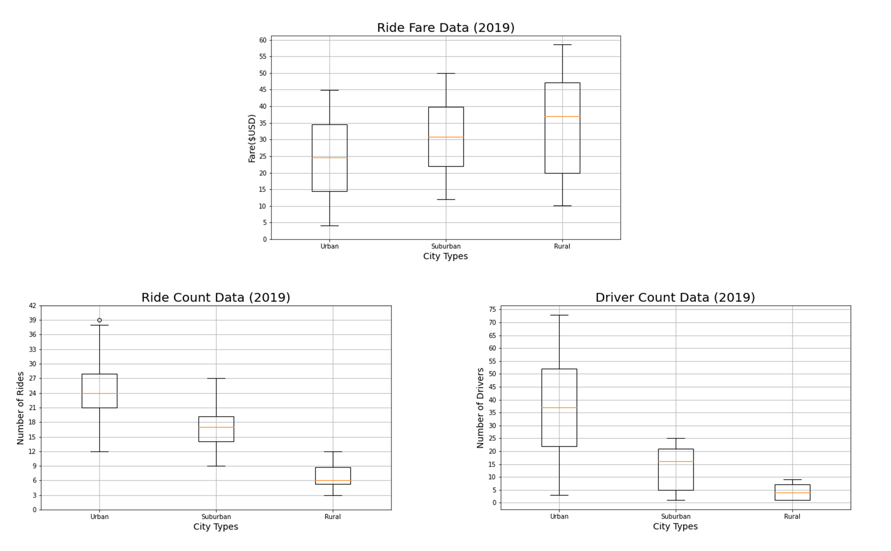
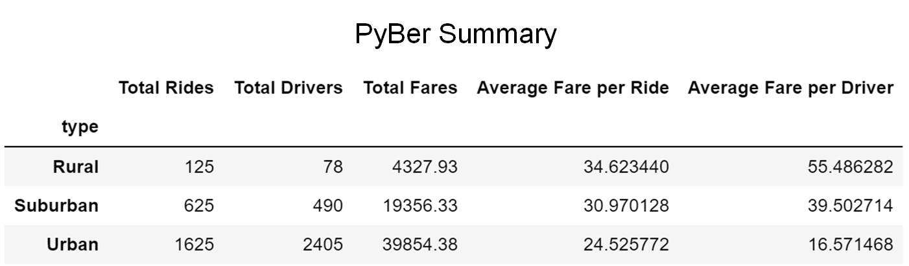
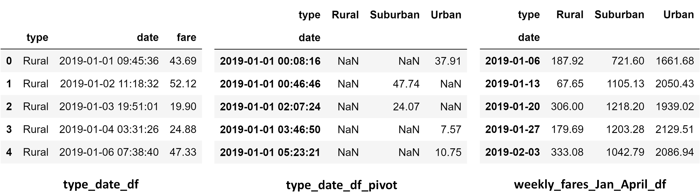
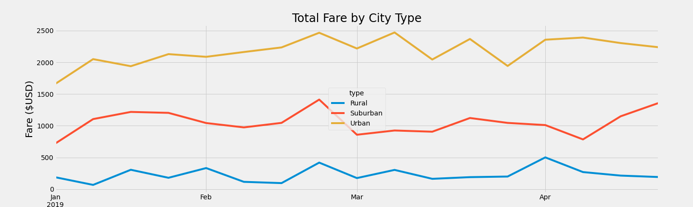

# PyBer_Analysis

  

## Table of Contents
* [Overview](https://github.com/rkaysen63/PyBer_Analysis/blob/master/README.md#overview)
* [Resources](https://github.com/rkaysen63/PyBer_Analysis/blob/master/README.md#resources)
* [Results](https://github.com/rkaysen63/PyBer_Analysis/blob/master/README.md#results)
* [Summary](https://github.com/rkaysen63/PyBer_Analysis/blob/master/README.md#summary)

## Overview:

The CEO of PyBer, a ride-sharing app company, has requested visualizations of ride-share data among different city types, in order to understand and improve ride-share access and affordability in underserved areas.  Cities were broken into 3 types:  Urban, Suburban, and Rural.   Ride-sharing data was analyzed to determine the total rides, total drivers, total fares, average fare per ride and driver, and total fare by city type.

## Resources

* Data Sources:
  * city_data.csv
  * ride_data.csv
* Software: Python 3.7.9 in Jupyter Notebook interface
* Lesson Plan: UTA-VIRT-DATA-PT-02-2021-U-B-TTH, Module 5 Challenge

## Results:

  

  

  

    
* The results show that there is a disparity between different city types in every metric. Rural cities have the least number of ride-shares, least number of drivers and the least amount in total fares, while urban cities have the greatest of these.  Conversely, the average fare per rider and average fare per driver is the greatest in rural cities and least in urban cities.  The number of drivers is directly proportional to the number of riders.  As the number of riders increases, so does the demand for drivers.  Fares are inversely proportional.  As the number of riders and consequently the number of drivers increases, the fares per ride and fare per driver decrease.
    
  * The ride-share data came from two sources:  city_data.csv and ride_data.csv.  Before any analysis could be performed, the data had to be checked for missing data that would result in errors or a bad analysis. Pandas was imported so that the data sources could be read as Pandas DataFrames. The subsequent DataFrames, ride_data_df and city_data_df, were then checked for null values and in both cases no null values were found.  Verified clean, the DataFrames were combined into a single DataFrame, pyber_data_df, which was used, to gather the totals for *PyBer Summary*.

  * *PyBer Summary* DataFrame (pyber_data_df), shown in the image above, was created from five pandas.Series.  
  
  * Total Rides by City Type Series  
    The total_rides by city Series was created using the `groupby()` function on the pyber_data_df to sort the data by city "type" and count the number of rides, "ride_id", for each city type.  
    `total_rides = pyber_data_df.groupby(["type"]).count()["ride_id"]`
  
  * Total Drivers by City Type Series  
    The total_drivers by city Series was created using the `groupby()` function on the city_data_df to sort the data by city "type" and sum the number of drivers, "driver_count", for each city type.  It is important to note that the original city_data_df was used to sum the driver counts because the merged data_frame included in the driver_count on each row where a city was listed.  Therefore, the sum of "driver_count" for each city type in pyber_data_df would not be correct because the driver_count by city would be summed repeatedly for however many times that city appeared in the data frame.   
    `total_drivers = city_data_df.groupby(["type"]).sum()["driver_count"]`  
  
  * Total Fares by City Type Series  
    The total_fares by city Series was created using the `groupby()` function on the pyber_data_df to sort the data by city "type" and sum the fares, "fare", for each city type.  
    `total_fares = pyber_data_df.groupby(["type"]).sum()["fare"]`  
    
  * Average Fare per Ride per City Type Series  
    The average fare per rider is the total fares divided by total rides.  And since total_fares and total_rides are indexed by city type, the average fares will be displayed as a Series indexed by city type.  
    `avg_fare_per_ride = total_fares/total_rides`  

  * Total Fare per City Type Series  
    The average fare per driver, similarly, is the total fares divided by total drivers.  And since total_fares and total_drivers are indexed by city type, the average fares will be displayed as a Series indexed by city type.  
    `avg_fare_per_driver = total_fares/total_drivers` 
    
  * These Series were combined into  a new DataFrame using Pandas `pd.DataFrame()`.  
       
         pyber_summary_df = pd.DataFrame({"Total Rides": total_rides,  
             "Total Drivers": total_drivers,   
             "Total Fares": total_fares,   
             "Average Fare per Ride": avg_fare_per_ride,   
             "Average Fare per Driver": avg_fare_per_driver}) 
  * Then pyber_summary was reformatted for presentation purposes.

  

   

  

   
  
* It is evident upon reviewing the multiple line plot, "Total Fare by City Type, that the disparity in total fare by city type is consistent from week to week, regardless of fluctuations.  Urban cities generate the largest total fare and rural cities generate the lowest.  The rural cities' total fare at best may be only 20% of the urban cities' total fare.  The method to obtain the results used to make line plot are described below. 
  * Creating type_date_df:  
  A DataFrame, type_date_df, was created using the groupby() function on the "type" and "date" columns of pyber_data_df, and the sum() method was applied on the "fare" column to obtain the total fare amount for each date and time.  In the resulting DataFrame, the "date" and "fare" columns are grouped by the city type, i.e. "Urban", "Suburban", and "Rural", but each city type only appears once in the "type" column for the entire group rather than as single entries on each row of the DataFrame.  
  `type_date_df = pyber_data_df.groupby(["type", "date"]).sum()[["fare"]]`  
  In order to add an index for pivoting later and to return single entries for the city types, the `.reset_index()` function was employed.  
  `type_date_df = type_date_df.reset_index()`  
  * Creating type_date_df_pivot:  
    A DataFrame pivot table, type_date_df_pivot, was created with "date" as the index, "type" of city as the columns, and the fares summed by date, "fare", as the values in the columns using the `pivot() function`.  
    `type_date_df_pivot = type_date_df.pivot(index="date", columns="type", values="fare")`    
  * Creating weekly_fares_Jan_April_df:  
    Step 1:  Using the loc method, a DataFrame that only includes the dates January 1, 2019 through April 28, 2019 was created from the pivot table, type_date_df_pivot.  
    `fares_Jan_April_df = type_date_df_pivot.loc['2019-01-01':'2019-04-29']`  
    
    Step 2: Then the "date" index was converted to a `datetime64[ns]` data type (dtype).
    `fares_Jan_April_df.index = pd.to_datetime(fares_Jan_April_df.index)`  
      
    Step 3:  The `DatetimeIndex` was confirmed using `.info()`,  
    `fares_Jan_April_df.info()`  
    
    which retured information about fares_Jan_April_df, that included:  
    ***DatetimeIndex***: 2196 entries, 2019-01-01 00:08:16 to 2019-04-28 19:35:03, thus verifying that the index is indeed a "Datetime Index."  
    
    Step 4:  The final version of the DataFrame, weekly_fares_Jan_April_df, was created using the `resample()` and `sum()` functions to combine the dates into weekly bins and to show the sum of the fares for each week.  
    `weekly_fares_Jan_April_df = fares_Jan_April_df.resample('W').sum()`  
  * The graph "Total Fare by City Type", displayed above in the "fivethirtyeight" style, was created from weekly_fares_Jan_April_df and saved to the "analysis" folder as "fare_by_type.png".  
          
          from matplotlib import style  
          plt.style.use('fivethirtyeight')  
          weekly_fares = weekly_fares_Jan_April_df.plot(figsize = (20, 6))  
          weekly_fares.set_title("Total Fare by City Type", fontsize=24)  
          weekly_fares.set_xlabel("")  
          weekly_fares.set_ylabel("Fare ($USD)", fontsize=20)  
          plt.savefig("analysis/fare_by_type.png")  
          plt.show()  
          plt.tight_layout()

## Summary:

One obvious reason for the disparity in ride-share data among city types is population density, which cannot be helped.  Before additional time and money are applied to improving ride-share in underserved areas, perhaps the results for each city type could be normalized to account for the disparity in population density and then compared.

That aside there still may be ways to improve ride-share use in underserved areas.  Some recommendations follow:

1. Launch advertising campaign in app and through social media outlets to ride-share customers in rural and suburban areas.
2. Develop a customer survey to understand what drives consumers to use-ride share.  Likewise develop a similar survey for drivers to see what incentives can be offered to draw more drivers to serve underserved areas.
3. Identify peak and off-peak "seasons" and offer incentives such a fare specials to boost riders.
4. Coordinate with event centers, museums, theaters, restaurants, cinemas, concert venues, ball parks, hotels and resorts in underserved areas to develop mutually beneficial relationships that offer incentives to both riders and drivers in order to boost ride-share to and from places of interest and lodging.  
  
[Back to the Table of Contents](https://github.com/rkaysen63/PyBer_Analysis/blob/master/README.md#table-of-contents)
