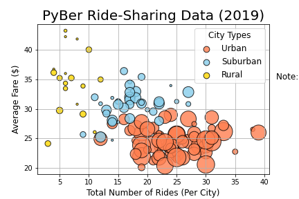
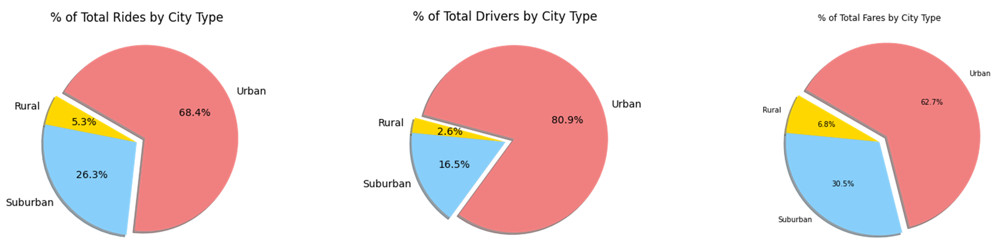

# PyBer_Analysis
<p align="center">
  
</p>

## Table of Contents
* [Overview](https://github.com/rkaysen63/PyBer_Analysis/blob/master/README.md#overview)
* [Resources](https://github.com/rkaysen63/PyBer_Analysis/blob/master/README.md#resources)
* [Results](https://github.com/rkaysen63/PyBer_Analysis/blob/master/README.md#results)
* [Summary](https://github.com/rkaysen63/PyBer_Analysis/blob/master/README.md#summary)

## Overview:

The CEO of PyBer, a ride-sharing app company, has requested visualizations of ride-share data among different city types, in order to understand and improve ride-share access and affordability in underserved areas.  Cities were broken into 3 types:  Urban, Suburban, and Rural.   Ride-sharing data was analyzed to determine the total rides, total drivers, total fares, average fare per ride and driver, and total fare by city type.

## Resources

* Data Sources:
  * city_data.csv
  * ride_data.csv
* Software: Python 3.7.9 in Jupyter Notebook interface
* Lesson Plan: UTA-VIRT-DATA-PT-02-2021-U-B-TTH, Module 5 Challenge

## Results:

<p align="center">
  
</p>

<p align="center">
  
</p>

<p align="center">
  
</p>
    
* The results show that there is a disparity between different city types in every metric. Rural cities have the least number of ride shares, least number of drivers and the least amount in total fares, while urban has the greatest of these.  Conversely, the average fare per rider and average fare per driver is the greatest in rural cities and least in urban cities.  The number of drivers is directly proportional to the number of riders.  As the number of riders increases, so does the demand for drivers.  Fares are inversely proportional.  As the number of riders and consequently the number of drivers increases, the fares per ride and fare per driver decrease.
    
  * The ride-share data came from two sources:  city_data.csv and ride_data.csv.  Before any analysis could be performed, the data had to be checked for missing data that would result in errors or a bad analysis. Pandas was imported so that the data sources could be read as Pandas dataframes. The subsequent dataframes, ride_data_df and city_data_df, were then checked for null values and in both cases no null values were found.  Verified clean, the dataframes were combined into a single dataframe, pyber_data_df, which was used, to gather the totals for *PyBer Summary*.

  * *PyBer Summary* dataframe, shown in the image above, was created from five Series.
  * Total Rides by City Type  
    The total_rides by city series was created using the `groupby()` function on the pyber_data_df to sort the data by city "type" and count the number of rides, "ride_id", for each city type.  
    `total_rides = pyber_data_df.groupby(["type"]).count()["ride_id"]`
  
  * Total Drivers by City Type  
    The total_drivers by city series was created using the `groupby()` function on the city_data_df to sort the data by city "type" and sum the number of drivers, "driver_count", for each city type.  It is important to note that the original city_data_df was used to sum the driver counts because the merged data_frame included in the driver_count on each row where a city was listed.  Therefore, the sum of "driver_count" for each city type in pyber_data_df would be incorrect because the driver_count by city would be repeated for however many times that city appeared in the data frame.   
    `total_drivers = city_data_df.groupby(["type"]).sum()["driver_count"]`  
  
  * Total Fares by City Type  
    The total_fares by city series was created using the `groupby()` function on the pyber_data_df to sort the data by city "type" and sum the fares, "fare", for each city type.  
    `total_fares = pyber_data_df.groupby(["type"]).sum()["fare"]`  
    
  * Average Fare per Ride per City Type  
    The average fare per rider is the total fares divided by total rides.  And since total_fares and total_rides are indexed by city type, the average faress will be displayed as a series indexed by city type.  
    `avg_fare_per_ride = total_fares/total_rides`  

  * Total Fare per City Type  
    The average fare per driver, similarly, is the total fares divided by total drivers.  And since total_fares and total_drivers are indexed by city type, the average fares will be displayed as a series indexed by city type.  
    `avg_fare_per_driver = total_fares/total_drivers` 
    
  * The series were combined into a new dataframe using Pandas `pd.DataFrame()`.  
     ```pyber_summary_df = pd.DataFrame({"Total Rides": total_rides,  "Total Drivers": total_drivers,   "Total Fares": total_fares,   "Average Fare per Ride": avg_fare_per_ride,   "Average Fare per Driver": avg_fare_per_driver})```  
    Then pyber_summary was reformatted for presentation purposes.

<p align="center">
  
</p>   

<p align="center">
  
</p>   
  * Creating the type_date_df  
    A DataFrame was created using the groupby() function on the "type" and "date" columns, and the sum() method is applied on the "fare" column to show the total fare amount for each date and time. (10 pt)
  * Creating the type_date_df_pivot  
    A DataFrame was created using the pivot() function where the index is the "date," the columns are the city "type," and the values are the "fare." (10 pt)
  * Creating the weekly_fares_Jan_April_df  
    A DataFrame was created using the loc method on the date range: 2019-01-01 through 2019-04-29. (5 pt)
A DataFrame was created using the resample() function in weekly bins and shows the sum of the fares for each week. (10 pt)
  *  An annotated chart showing the total fares by city type is created and saved to the "analysis" folder. (10 pt)

## Summary:

There is a statement summarizing three business recommendations to the CEO for addressing any disparities among the city types. (4 pt)

Summary:

There is a statement summarizing three business recommendations to the CEO for addressing any disparities among the city types. (4 pt)


* [Back to the Top](https://github.com/rkaysen63/PyBer_Analysis/blob/master/README.md#PyBer-Analysis)
