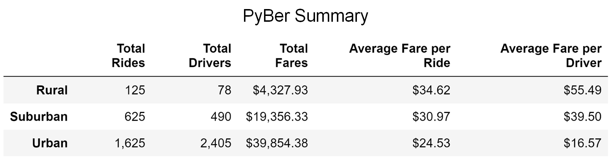

# PyBer_Analysis
<p align="center">
  
</p>

## Table of Contents
* [Overview](https://github.com/rkaysen63/PyBer_Analysis/blob/master/README.md#overview)
* [Resources](https://github.com/rkaysen63/PyBer_Analysis/blob/master/README.md#resources)
* [Results](https://github.com/rkaysen63/PyBer_Analysis/blob/master/README.md#results)
* [Summary](https://github.com/rkaysen63/PyBer_Analysis/blob/master/README.md#summary)

## Overview:

The CEO of PyBer, a ride-sharing app company, has requested visualizations of ride-share data among different city types, in order to understand and improve ride-share access and affordability in underserved areas.  Cities were broken into 3 types:  Urban, Suburban, and Rural.   Ride-sharing data was analyzed to determine the total rides, total drivers, total fares, average fare per ride and driver, and total fare by city type.

## Resources

* Data Sources:
  * city_data.csv
  * ride_data.csv
* Software: Python 3.7.9 in Jupyter Notebook interface
* Lesson Plan: UTA-VIRT-DATA-PT-02-2021-U-B-TTH, Module 5 Challenge

## Results:

<p align="center">
  
</p>
  
<p align="center">
  
</p>

* The ride-share data came from two sources:  city_data.csv and ride_data.csv.  Before any analysis could be performed, the data had to be checked for missing data that would result in errors or a bad analysis. Pandas was imported so that the data sources could be read as Pandas dataframes. The subsequent dataframes, ride_data_df and city_data_df, were then checked for null values and in both cases no null values were found.  Verified clean, the dataframes were combined into a single dataframe, pyber_data_df, which was used, to gather the totals for *PyBer Summary*.

* *PyBer Summary* dataframe, shown in the image above, was created from five Series.
  * Total Rides by City Type  
    The total_rides by city series was created using the groupby() function on the pyber_data_df to sort the data by city "type" and count the number of rides, "ride_id" for each city type.
    `total_rides = pyber_data_df.groupby(["type"]).count()["ride_id"]`
  
  * Total Drivers by City Type  
    The total_drivers by city series was created using the groupby() function on the city_data_df to sort the data by city "type" and sum the number of drivers, "driver_count", for each city type.  It is important to note that the original city_data_df was used to sum the driver counts because the merged data_frame brought in the driver_count onto each row where a city was listed.  Therefore, the sum the number of drivers in pyber_data_df would actually be the sum times a multiple of however many times that city appeared in the data frame.  
    `total_drivers = city_data_df.groupby(["type"]).sum()["driver_count"]`  
  
  * Total Fares by City Type  
    The total_fares by city series was created using the groupby() function on the pyber_data_df to sort the data by city "type" and sum the fares, "fare", for each city type.
    `total_fares = pyber_data_df.groupby(["type"]).sum()["fare"]`  
    
  * Average Fare per Ride per City Type  
    The average fare per rider is the total fares divided by total rides.  And since each series is indexed by city type, the averages will be displayed as a series indexed by city type. 
    `avg_fare_per_ride = total_fares/total_rides`  

  * Total Fare per City Type  
    The average fare per driver, similarly, is the total fares divided by total drivers.  And since each series is indexed by city type, the averages will be displayed as a series indexed by city type.
    
  * The series were combined into a new dataframe using Pandas `pd.DataFrame()`.  
    ```pyber_summary_df = pd.DataFrame({"Total Rides": total_rides,  "Total Drivers": total_drivers,   "Total Fares": total_fares,   "Average Fare per Ride": avg_fare_per_ride,   "Average Fare per Driver": avg_fare_per_driver})```  
    Then pyber_summary was reformatted for presentation purposes.
    
    
    
    
    There is a description of the differences in ride-sharing data among the different city types. Ride-sharing data include the total rides, total drivers, total fares, average 
    The pie charts from a previous analysis and the "PyBer Summary
    
    
    
    
    
    fare per ride and driver, and total fare by city type. (7 pt)

## Summary:

There is a statement summarizing three business recommendations to the CEO for addressing any disparities among the city types. (4 pt)


Deliverable 1 Requirements
You will earn a perfect score for Deliverable 1 by completing all requirements below:

The total number of rides for each city type is retrieved. (5 pt)
The total number of drivers for each city type is retrieved. (5 pt)
​The sum of the fares for each city type is retrieved. (5 pt)
​The average fare per ride for each city type is calculated. (5 pt)
The average fare per driver for each city type is calculated. (5 pt)
A PyBer summary DataFrame is created. (5 pt)
The PyBer summary DataFrame is formatted as shown in the example. (5 pt)

Deliverable 2 Requirements
You will earn a perfect score for Deliverable 2 by completing all requirements below:

A DataFrame was created using the groupby() function on the "type" and "date" columns, and the sum() method is applied on the "fare" column to show the total fare amount for each date and time. (10 pt)
A DataFrame was created using the pivot() function where the index is the "date," the columns are the city "type," and the values are the "fare." (10 pt)
A DataFrame was created using the loc method on the date range: 2019-01-01 through 2019-04-29. (5 pt)
A DataFrame was created using the resample() function in weekly bins and shows the sum of the fares for each week. (10 pt)
An annotated chart showing the total fares by city type is created and saved to the "analysis" folder. (10 pt)

Deliverable 3 Requirements
Structure, Organization, and Formatting (6 points)
The written analysis has the following structure, organization, and formatting:

There is a title, and there are multiple sections. (2 pt)
Each section has a heading and subheading. (2 pt)
Links to images are working and displayed correctly. (2 pt)
Analysis (14 points)
The written analysis has the following:

Overview of the analysis:

The purpose of the new analysis is well defined. (3 pt)
Results:

There is a description of the differences in ride-sharing data among the different city types. Ride-sharing data include the total rides, total drivers, total fares, average fare per ride and driver, and total fare by city type. (7 pt)
Summary:

There is a statement summarizing three business recommendations to the CEO for addressing any disparities among the city types. (4 pt)
